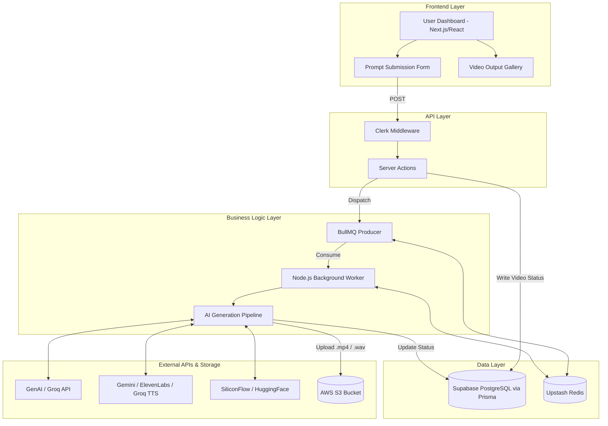
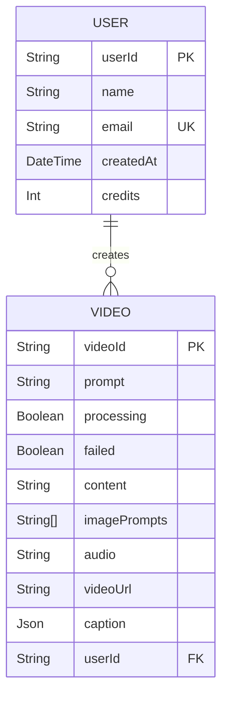

# Feature Implementation Plan: Shorts AI Pipeline

## Goal
Implement a highly scalable, asynchronous background processing pipeline that takes user text prompts or long-form video URLs and automatically generates short-form narrated videos. The pipeline must handle scriptwriting, multi-model TTS audio generation, image generation, captioning, and programmatic video assembly, uploading the final result to AWS S3.

## Requirements

- Provide an intuitive Next.js frontend for prompt submission.
- Ensure all heavy AI processing is decoupled from the web server using BullMQ.
- Support robust multi-model fallback chains (Gemini -> ElevenLabs -> Groq) for text-to-speech.
- Include a BYOP (Bring Your Own Pollen) model for scalable image generation.
- Automatically restart and flag stalled jobs if the worker goes offline.

## Technical Considerations

### System Architecture Overview



- **Technology Stack Selection**: 
  - *Frontend*: Next.js App Router for optimal Server Actions integration.
  - *Data Layer*: Prisma for type-safe database querying, Supabase (PostgreSQL) for relational data, and Upstash Redis for serverless queue state.
  - *Business Logic*: BullMQ for resilient, retryable background job processing outside the Next.js request lifecycle.
- **Integration Points**: AI APIs are integrated via native fetch with AbortSignals and timeouts.
- **Scalability Considerations**: The background worker can be horizontally scaled or its concurrency increased based on the Upstash Redis tier.

### Database Schema Design



- **Table Specifications**: `Video` tracks the entire lifecycle of a generation job.
- **Indexing Strategy**: Primary keys on `userId` and `videoId`.
- **Database Migration Strategy**: Prisma migrations.

### API Design

- **Endpoints**: Utilizes React Server Actions instead of traditional REST endpoints for tighter frontend integration. 
- Example Action: `convertLongToShortAction(sourceUrl: string, captionStyle: string)` -> Returns `{ success: boolean, videoId: string }`.
- **Authentication**: Clerk `currentUser()` validation in all server actions.
- **Error Handling**: Graceful fallback chains within the worker; database record flagged `failed: true` if all fallbacks fail.

### Frontend Architecture

###### Component Hierarchy Documentation

**Layout Structure:**
```text
Video Dashboard
├── Header Section (shadcn: Card)
│   ├── User Profile (Clerk: UserButton)
│   └── Credit Balance (shadcn: Badge)
├── Main Content Area
│   ├── Creation Form (Form)
│   │   ├── Prompt Input (shadcn: Textarea)
│   │   ├── Style Selection (shadcn: Select)
│   │   └── Generate Button (shadcn: Button, animated via Framer Motion)
│   └── Output Grid
│       └── Video Card (HeroUI: Card)
│           ├── Thumbnail / Cover (ui/cover.tsx)
│           ├── Video Title
│           └── Quick Actions (Download, Share)
```

- **State Management**: React `useState` and `useFormStatus` for optimistic updates during queueing.

### Security Performance

- **Authentication**: All API requests are authenticated by Clerk.
- **Performance**: Heavy tasks moved to BullMQ worker, avoiding Vercel serverless function timeouts. S3 uploads streamed directly from memory buffers.
